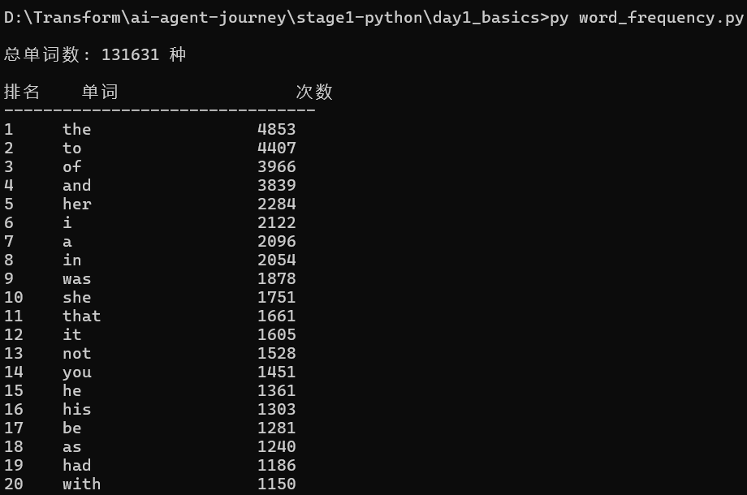

# Day 1 笔记：Python 基础 + 词频统计实战

> 2026-06-18 | 第一阶段 Day 1  
> 已掌握 C，从 CS 视角对比学习 Python

---

## 一、Python 四大数据结构速查表

### 1. List（列表）— 最全能

相当于 C 的动态数组，但啥都能塞，自带一堆方法。

| 操作     | 方法                      | 说明                                             |
| -------- | ------------------------- | ------------------------------------------------ |
| **增**   | `append(x)`               | 末尾追加（最常用）                               |
|          | `insert(i, x)`            | 在索引 `i` 处插入 `x`                            |
|          | `extend(iterable)`        | 批量追加，拼接另一个列表                         |
| **删**   | `pop(i)`                  | 移除并返回索引 `i` 的元素，不写 `i` 默认最后一个 |
|          | `remove(x)`               | 移除第一个值为 `x` 的元素，找不到报错            |
|          | `clear()`                 | 清空整个列表                                     |
| **改**   | `list[i] = new`           | 直接索引赋值                                     |
|          | `reverse()`               | 原地反转顺序                                     |
|          | `sort()`                  | 原地排序，默认升序，`reverse=True` 降序          |
| **查**   | `index(x)`                | 返回第一个值为 `x` 的索引，找不到报错            |
|          | `count(x)`                | 统计 `x` 出现次数                                |
| **通用** | `len(list)`               | 长度                                             |
|          | `max(list)` / `min(list)` | 最大 / 最小值                                    |
|          | `sorted(list)`            | 返回新排序列表，**不改变原列表**                 |

#### 切片（Slice）— C 没有的利器

```python
lst = [0, 1, 2, 3, 4, 5]
lst[1:4]   # [1, 2, 3]           从索引1到3（左闭右开）
lst[:3]    # [0, 1, 2]            从头到索引2
lst[3:]    # [3, 4, 5]            从索引3到末尾
lst[::-1]  # [5, 4, 3, 2, 1, 0]  反转
lst[::2]   # [0, 2, 4]            步长2
```

---

### 2. Tuple（元组）— 不可变的列表

一旦创建就不能改。常用于函数返回多个值、作为 dict 的 key。

| 操作 | 方法       | 说明                      |
| ---- | ---------- | ------------------------- |
| 查   | `count(x)` | 统计 `x` 出现次数         |
|      | `index(x)` | 返回第一个值为 `x` 的索引 |

#### 解包（Unpacking）— 最常用的 tuple 操作

```python
a, b, c = (1, 2, 3)         # 一一对应
a, *rest = (1, 2, 3, 4)     # a=1, rest=[2,3,4]
```

---

### 3. Dict（字典）— 键值对

相当于 C 的 hashmap / 哈希表，**增和改用同样的语法**（key 存在就是改，不存在就是增）。

| 操作        | 方法                       | 说明                                                   |
| ----------- | -------------------------- | ------------------------------------------------------ |
| **增 / 改** | `d[key] = value`           | 存在则改，不存在则增                                   |
|             | `update(other_dict)`       | 合并另一个字典，重复的覆盖                             |
|             | `setdefault(key, default)` | key 存在返回原值，不存在插入并设默认值                 |
| **删**      | `pop(key)`                 | 移除并返回，key 必须存在                               |
|             | `popitem()`                | 随机移除一个键值对                                     |
|             | `clear()`                  | 清空                                                   |
| **查**      | `d[key]`                   | 直接取，key 不存在 → `KeyError`                        |
|             | `get(key, default)`        | **推荐！** key 不存在返回 default（默认 None），不报错 |
|             | `keys()`                   | 所有键的视图，可遍历                                   |
|             | `values()`                 | 所有值的视图                                           |
|             | `items()`                  | 所有 `(key, value)` 对的视图，**遍历最常用**           |

#### 遍历 dict 的 Python 写法

```python
for key, value in d.items():
    print(f"{key}: {value}")
```

---

### 4. Set（集合）— 无序不重复

相当于数学里的集合，元素必须可哈希（不可变）。

| 操作   | 方法               | 说明                              |
| ------ | ------------------ | --------------------------------- |
| **增** | `add(x)`           | 添加一个元素，已存在则无效果      |
|        | `update(iterable)` | 批量添加                          |
| **删** | `remove(x)`        | 移除，不存在报错                  |
|        | `discard(x)`       | 移除，不存在 **不报错**（更安全） |
|        | `pop()`            | 随机弹出一个（无序）              |
|        | `clear()`          | 清空                              |
| **查** | `x in s`           | O(1) 判断存在，极快               |

#### 集合运算（精髓所在）

```python
a = {1, 2, 3}
b = {3, 4, 5}

a | b   # 并集   {1, 2, 3, 4, 5}
a & b   # 交集   {3}
a - b   # 差集   {1, 2}        在 a 但不在 b
a ^ b   # 对称差 {1, 2, 4, 5}  不同时在 a 和 b 中
```

#### 快速对比：什么时候用什么

| 场景                          | 用什么  |
| ----------------------------- | ------- |
| 有序、需要改内容              | `list`  |
| 有序、不需要改、作为 dict key | `tuple` |
| key → value 映射、快速查找    | `dict`  |
| 去重、判断存在、集合运算      | `set`   |

---

## 二、实战项目：文本词频统计

### 项目说明

读取一篇英文原著，统计每个单词的出现次数，按频率降序输出。

### 测试数据

《傲慢与偏见》（Pride and Prejudice — Jane Austen）全文，从 Project Gutenberg 下载，约 75 万字符。

### 核心代码

```python
import re
from pathlib import Path

def count_words(text: str) -> dict[str, int]:
    """统计文本中每个单词的出现次数"""
    text = text.lower()
    words = re.findall(r"[a-zA-Z]+", text)
    freq = {}
    for word in words:
        freq[word] = freq.get(word, 0) + 1    # ← dict.get() 的妙用
    return freq

def print_top(freq: dict[str, int], n: int = 20) -> None:
    """按频次降序打印 Top-N"""
    sorted_items = sorted(freq.items(), key=lambda item: item[1], reverse=True)
    print(f"{'排名':<6}{'单词':<20}{'次数':<6}")
    print("-" * 32)
    for rank, (word, count) in enumerate(sorted_items[:n], start=1):
        print(f"{rank:<6}{word:<20}{count:<6}")

def main():
    file_path = Path(__file__).parent / "傲慢与偏见原文.txt"
    text = file_path.read_text(encoding="utf-8")
    freq = count_words(text)
    print(f"\n总单词数: {sum(freq.values())} 种\n")
    print_top(freq, n=20)

if __name__ == "__main__":
    main()
```

### 运行结果截图



### 关键收获（CS 视角）

| 代码 | C 思维对照 |
|------|-----------|
| `freq.get(word, 0) + 1` | C 里需要先 `if (exists)` 再 `++`，否则初始化为 1。Python 一行搞定 |
| `sorted(freq.items(), key=lambda item: item[1])` | C 里要对 hashmap 按 value 排序？先转数组再写 `qsort` 比较函数。Python 一行 lambda |
| `Path(__file__).parent` | 获取当前文件所在目录，比 C 的 `__FILE__` 宏 + 手动路径拼接强太多 |
| `enumerate(items, start=1)` | 遍历的同时给编号，从 1 开始。C 里要手动维护计数器 |
| `f"{变量}"` | Python 的 f-string，比 C 的 `printf("%s %d", ...)` 直观 |
| `re.findall(r"[a-zA-Z]+", text)` | C 里要写正则 → 编译 → 循环匹配 → 手动收集结果。Python 一行 |

### 统计数据

| 指标 | 数值 |
|------|------|
| 测试文本 | 《傲慢与偏见》英文全文 |
| 文本大小 | ~750 KB |
| 不同单词数 | **131,631** 种 |
| Top 1 | `the` — 4,853 次 |
| Top 2 | `to` — 4,407 次 |
| Top 3 | `of` — 3,966 次 |

> 📌 榜首全是停用词（stop words），后续学到 NLP 时会做过滤。
